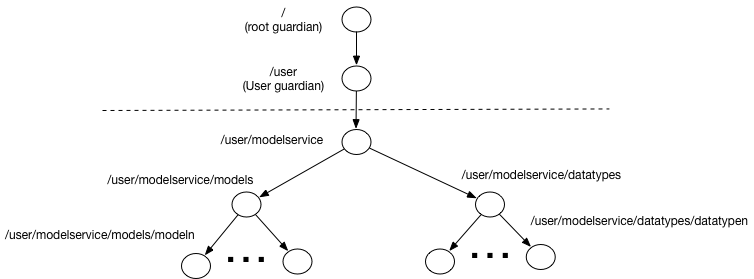

# Speculative model serving

##An experimental implementation of Speculative Model serving

According to [Wikipedia](https://en.wikipedia.org/wiki/Speculative_execution), speculative execution is:

>an optimization technique where a computer system performs some task that may not be needed. Work is done before it is known whether it is actually needed, so as to prevent a delay that would have to be incurred by doing the work after it is known that it is needed. If it turns out the work was not needed after all, most changes made by the work are reverted and the results are ignored.
>The objective is to provide more concurrency if extra resources are available. This approach is employed in a variety of areas, including branch prediction in pipelined processors, value prediction for exploiting value locality, prefetching memory and files, etc.

In the case on Model Serving, speculative execution means evaluating result (in parallel) leveraging a set of models. The use case where this becomes important is when there are several models that differ in performance or result quality (in different cases). Usage of such approach, described in details by Ted Dunning, in his [Machine Learning Logistics book](https://mapr.com/ebook/machine-learning-logistics/). 
He calls this approach Rendezvous pattern and provides a lot of details on application and implementation of the pattern. Here we will deviate a little bit from his description and integrate it with dynamic update of models described in [models serving book](https://info.lightbend.com/ebook-serving-machine-learning-models-register.html?utm_source=oreilly&utm_medium=link&utm_campaign=COLL-2017-Operationalizing-Machine-Learning&utm_term=none&utm_content=none).

The importance of speculative execution in model serving steams from ability of such approach to provide the following features for machine serving applications:
1. Guaranteed execution time. Assuming that we have several models with the fastest providing fixed execution time, it is possible to provide a model serving implementation with the fixed time, which has to be larger than execution time of the simplest model
2. Consensus based model serving. Assuming that we have several models, we can implement model serving, where the majority of the models agree on prediction.
3. Quality based model serving. Assuming that we have an algorithm allowing to evaluate quality of model serving result, such approach allows to pick result with the best quality.
It is, of course, possible to combine multiple feature, for example, consensus based serving with the guaranteed execution time, where the result is consensus of the model serving completed within a given time interval.

Overall architecture for speculative model serving is presented below:

Here incoming data is coming into both - Model serving controller and Model learning. Model Learning component is used for periodic recalculation of models and pushing them into Kafka for update. In the heart of our implementation is Model serving controller responsible for orchestration of execution of individual model servers and deciding on the final model serving result. 

Once replies from all of the individual model servers are received or the wait time expires, model serving controller choses reply (based on defined criteria), the reply is propagated to the stream. Individual model servers process the input data based on the their current model and return results back to the model serving controller. Additionally individual model servers are listening on model queues for their models update. 

To improve handshake in our implementation, every model serving controller incoming request is assigned a unique id ([GUID](https://en.wikipedia.org/wiki/Universally_unique_identifier)), which is passed to individual model server and is returned back to the controller along with the serving result. Also, model serving result can be accompanied by a confidence level. This information is optional and, if present, can be used by controller to evaluate result. Additional optional fields can be added to the model server replies for use by results evaluation.
With this in place, messages for invoking model server and its reply can be represented as follows (we are using [Protocol Buffers](https://developers.google.com/protocol-buffers/) for encoding messages):

````
syntax = "proto3";

option java_package = "com.lightbend.speculative";

// Description of the model serving request.
message ServingRequest {
   string uuid = 1;
   bytes data = 2;
}

// Description of the model serving response.
message ServingResponse {
   string uuid = 1;
   bytes data = 2;
   double confidence = 3;
   repeated ServingQualifier qualifiers = 4;
}

// Description of the model serving qualifier.
message ServingQualifier{
   string key = 1;
   string value = 2;
}
````
Although there are many different options for implementing this architecture, we will show how to implement it leveraging [Akka streams](https://doc.akka.io/docs/akka/2.5/stream/index.html) 
[integrated with Actors](https://doc.akka.io/docs/akka/2.5/stream/stream-integrations.html). We will implement individual model servers and model service controller as [Actors](https://doc.akka.io/docs/akka/2.5/actors.html) 
and use [Akka streams](https://doc.akka.io/docs/akka/2.5/stream/index.html) for overall orchestration of execution and [Akka HTTP](https://doc.akka.io/docs/akka-http/current/index.html) for providing HTTP access to our implementation.
When creating Akka actors application we need to first design actor’s hierarchy. Following [actor’s design documentation](https://doc.akka.io/docs/akka-http/current/index.html), we decided on the following actors hierarchy



Here we have introduced the following actors:
* Modelservice Actor is the root of our custom actor’s hierarchy and is responsible for overall management of our application actors and routing messages across the rest of actors. 
* Models is the manager of all model servers. It is responsible for creation and management of individual model servers and routing to them model updates. 
* Model N is an implementation of the model server responsible for serving an individual model
* Data types is a manager of all model serving controllers. It is responsible for creation and management of individual model serving controllers and routing to them model serving data requests.
* Data type N is an implementation of the model serving controller responsible for coordination of individual model serving and deciding on the result. It uses a set of models for actual model serving.

<<More to come>>