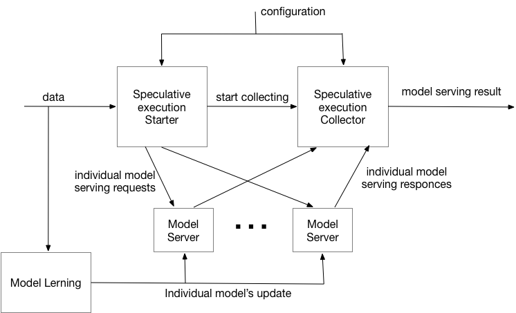
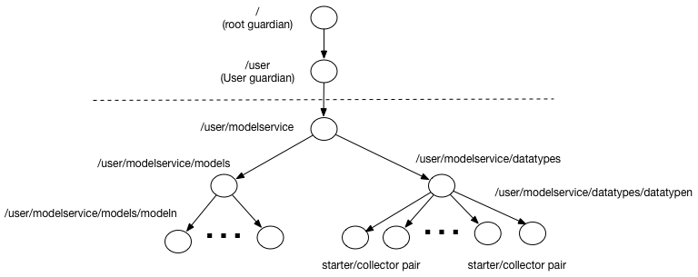

# Speculative model serving

##An experimental implementation of Speculative Model serving

According to [Wikipedia](https://en.wikipedia.org/wiki/Speculative_execution), speculative execution is:

>an optimization technique where a computer system performs some task that may not be needed. Work is done before it is known whether it is actually needed, so as to prevent a delay that would have to be incurred by doing the work after it is known that it is needed. If it turns out the work was not needed after all, most changes made by the work are reverted and the results are ignored.
>The objective is to provide more concurrency if extra resources are available. This approach is employed in a variety of areas, including branch prediction in pipelined processors, value prediction for exploiting value locality, prefetching memory and files, etc.

In the case on Model Serving, speculative execution means evaluating result (in parallel) leveraging a set of models. The use case where this becomes important is when there are several models that differ in performance or result quality (in different cases). Usage of such approach, described in details by Ted Dunning, in his [Machine Learning Logistics book](https://mapr.com/ebook/machine-learning-logistics/). 
He calls this approach Rendezvous pattern and provides a lot of details on application and implementation of the pattern. Here we will deviate a little bit from his description and integrate it with dynamic update of models described in [models serving book](https://info.lightbend.com/ebook-serving-machine-learning-models-register.html?utm_source=oreilly&utm_medium=link&utm_campaign=COLL-2017-Operationalizing-Machine-Learning&utm_term=none&utm_content=none).

The importance of speculative execution in model serving steams from ability of such approach to provide the following features for machine serving applications:
1. Guaranteed execution time. Assuming that we have several models with the fastest providing fixed execution time, it is possible to provide a model serving implementation with the fixed time, which has to be larger than execution time of the simplest model
2. Consensus based model serving. Assuming that we have several models, we can implement model serving, where the majority of the models agree on prediction.
3. Quality based model serving. Assuming that we have an algorithm allowing to evaluate quality of model serving result, such approach allows to pick result with the best quality.
It is, of course, possible to combine multiple feature, for example, consensus based serving with the guaranteed execution time, where the result is consensus of the model serving completed within a given time interval.

This project contains 2 implementation:
1. Single Speculative controller -
Overall architecture is presented below:
 Here incoming data is coming into both - Model serving controller and Model learning. Model Learning component is used for periodic recalculation of models and pushing them into Kafka for update. In the heart of our implementation is Model serving controller responsible for orchestration of execution of individual model servers and deciding on the final model serving result. 
Once replies from all of the individual model servers are received or the wait time expires, model serving controller choses reply (based on defined criteria), the reply is propagated to the stream. Individual model servers process the input data based on the their current model and return results back to the model serving controller. Additionally individual model servers are listening on model queues for their models update. 

2. Distributed Speculative controller -
Overall architecture is presented below:
 Here 
we have split model service controller into model serving starter/model serving collector pair. This allows to get rid of the synchronous
invocation of model servers, thus make overall execution more responsive (at the expense of the some extra complexity).
The rest of components have exactly the same funtionality as on the previous diagram.
 
To improve handshake (really only required for distributed case) in our implementation, every model serving controller incoming request is assigned a unique id ([GUID](https://en.wikipedia.org/wiki/Universally_unique_identifier)), which is passed to individual model server and is returned back to the controller along with the serving result. Also, model serving result can be accompanied by a confidence level. This information is optional and, if present, can be used by controller to evaluate result. Additional optional fields can be added to the model server replies for use by results evaluation.
With this in place, messages for invoking model server and its reply can be represented as follows (we are using [Protocol Buffers](https://developers.google.com/protocol-buffers/) for encoding messages):

````
syntax = "proto3";

option java_package = "com.lightbend.speculative";

// Description of the model serving request.
message ServingRequest {
   string uuid = 1;
   bytes data = 2;
}

// Description of the model serving response.
message ServingResponse {
   string uuid = 1;
   bytes data = 2;
   double confidence = 3;
   repeated ServingQualifier qualifiers = 4;
}

// Description of the model serving qualifier.
message ServingQualifier{
   string key = 1;
   string value = 2;
}
````
Although there are many different options for implementing this architecture, we will show how to implement it leveraging [Akka streams](https://doc.akka.io/docs/akka/2.5/stream/index.html) 
[integrated with Actors](https://doc.akka.io/docs/akka/2.5/stream/stream-integrations.html). We will implement individual model servers and model service controller as [Actors](https://doc.akka.io/docs/akka/2.5/actors.html) 
and use [Akka streams](https://doc.akka.io/docs/akka/2.5/stream/index.html) for overall orchestration of execution and [Akka HTTP](https://doc.akka.io/docs/akka-http/current/index.html) for providing HTTP access to our implementation.
When creating Akka actors application we need to first design actor’s hierarchy. Following [actor’s design documentation](https://doc.akka.io/docs/akka-http/current/index.html), we decided on the following actors hierarchies:

1. For single speculative controller:

2. For distributed speculative controller


For the case of a single speculative controller we have introduced the following actors:
* Modelservice Actor is the root of our custom actor’s hierarchy and is responsible for overall management of our application actors and routing messages across the rest of actors. 
* Models is the manager of all model servers. It is responsible for creation and management of individual model servers and routing to them model updates. 
* Model N is an implementation of the model server responsible for serving an individual model
* Data types is a manager of all model serving controllers. It is responsible for creation and management of individual model serving controllers and routing to them model serving data requests.
* Data type N is an implementation of the model serving controller responsible for coordination of individual model serving and deciding on the result. It uses a set of models for actual model serving.

In the case of distributed speculative controller, instead of Data type N we introduce a pair -
Data type N starter and Data type N collector

### ModelServingManager Actor
This actor is a singleton and provides the entry point into whole actor's system.
This actor manages 2 other managers:
* ModelManager actor responsible for lifecycle and invocation of model servers 
(the exception is SpeculativeModelServing Actor, invoking model servers dirctly)
* DataManager actor responsible for lifecycle and invocation of speculative model servers.
It supports all the methods providing by the rest of the actors by forwarding client's requests to
appropriate executors (ModelManager or DataManager)

The only method, that is not directly forwarded to the appropriate manager is speculative model server configuration (
invoked using `SpeculativeServer` message). Because ActorRefs are not exposed externally this method is leveraging a method
on model manager to convert resired models into ActorRefs before sending them to the Data manager

### ModelManager Actor
This actor is also a singleton responsible for lifecycle and and (some of) the invocations of model servers
Its main methods include
* Update Model (invoked using `ModelWithDescriptor` message) - this method is both lifecycle 
(if required model - given `modelID` does not exist, it is created) and execution method - model is forwarded 
to the appropriate model server

*__Note__ There is currently no support for removing model server actor*

* Get Model Server State (invoked using `GetModelServerState` message) - this method checks whether required 
model server exists (based on the model ID) and either forward request to it for execution or
returns empty state
* Get list of existing model servers (invoked using `GetModels` message - this method returns back the list of existing model servers
* Convert list of model names into list of model serving actors 
invoked using `GetModelActors` message) - this method translates a list of modelIDs to the list of corresponding model 
servers. This is a help method for speculative model server configuration (see below)

*__Note__ If a model server with a given modelID does not exist, it will be created*

### DataManager Actor
This actor is also a singleton responsible for lifecycle and and the invocations of speculative model servers
Its main methods include
* Configure speculative model server (invoked using `SetSpeculativeServer` message) - this is fire and forget method allowing to configure
speculative model server. It also serves as lifecycle method - if the server does not exist, it is created.
Otherwise, configuration is forwarded to the appropriate speculative model server (based on data type)

*__Note__ There is currently no support for removing speculative model server actor*
* Process data item (invoked using `WineRecord` message in the example, but any record intended for serving can be used here). Unlike 
in the case with model update, the new speculative model server is not created on the flight (it needs to be specifically
configured). So this method checks if appropriate speculative model server (based on the data type) exists and either forward request to it
or returns `Not processed` response


### SpeculativeModelServing Actor

This actor implements the actual speculative model serving based on the following parameters:
* List of model servers - list of ActorRefs used for actual model serving
* Timeout - a time to wait responce from the actual model server (by increasing this you can ensure that all model servers will have chance to deliver result)
* Decider - a custom class implementing `DeciderTrait`. This class needs to implement a single method
`decideResult` choosing 1 of the results collected by the speculative model server
in the given time interval. Different implementations of this class can provide 
different speculative model processing policies.
This actor provides the following methods.
* Configuration (invoked using `SetSpeculativeServer` message) - this method is responsible
for setting execution parameters (above) on the actor.
* Serve the model (invoked using `WineRecord` in this example, or any required data type) 
- this method is invoking a set of model servers (based on configuration) for serving data and then invokes decider class
to calculate the most appropriate result, return to the original invoker.

In addition this actor maintains statistics of the model execution `SpeculativeExecutionStats`, which can be 
requested using `GetSpeculativeServerState` message

There is an instance of this class for every data type supported by the system

### SpeculativeModelServing Starter/Collector Actors
In the case of distributed speculative model serving implementation the role of Speculative model serving
actor is implemented by a pair - starter and collector - actors 

#### SpeculativeModelServing Starter Actors

This actor initializes speculative model serving, based on the following parameters:
* List of model servers - list of ActorRefs used for actual model serving
* Collector - ActorRef of his dedicated collector 
This actor provides the following methods.
* Configuration (invoked using `SetSpeculativeServerStarter` message) - this method supports
updating of the list of supporting model servers 
* Serve the model (invoked using `WineRecord` in this example, or any required data type) 
- this method generates a unique GUID for this request and send it, along with requester to the collector actor.
It also forwards incoming request to a set of model servers (based on configuration) for serving data, specifying collector as a destination.

There is an instance of this class for every data type supported by the system

#### SpeculativeModelServing Collector Actors
This actor implements the actual speculative model serving based on the following parameters:
* Timeout - a time to wait responce from the actual model server (by increasing this you can ensure that all model servers will have chance to deliver result)
* Decider - a custom class implementing `DeciderTrait`. This class needs to implement a single method
`decideResult` choosing 1 of the results collected by the speculative model server
in the given time interval. Different implementations of this class can provide 
different speculative model processing policies.
This actor provides the following methods.
* Configuration (invoked using `SetSpeculativeServerCollector` message) - this method is responsible
for setting execution parameters (above) on the actor.
* Start speculative collection (invoked using `StartSpeculative` message) - this method sets up
all the structures necessary for collection of the particular request (based on GUID) and
also sets up timeout (as a self message)
* Process serving response from a model server (invoked using `ServingResponse` message) - this method
is invoked every time any of the model servers report the result.
It checks whether we are still watching responces for a given GUID, and if we do
it adds a response to an appropriate structure. It then checks whether we have enough
responses to produce a result, and if we do, uses its decider and sends the responce to the original invoker.
* Process timer stop (invoked using a `String` message containing GUID) - this method
is invoked when a time for speculative calculation expires. It first checks whether this GUID
is completed, and if is, does nothing. If it is still in progress it makes decision based on the results provided so far and sends
final result to the original requester

In addition this actor maintains statistics of the model execution `SpeculativeExecutionStats`, which can be 
requested using `GetSpeculativeServerState` message

There is an instance of this class for every data type supported by the system

### ModelServing Actor
This actor is a workhorse of the overal implementation and provides 2 main methods:
* Update Model (invoked using `ModelWithDescriptor` message) - a method responsible for updating curent model used for serving data
* Process Record (invoked using `ServingRequest` message) - a method responsible for processing a giving data request (using existing model to convert request into responce)
If there is no model defined, this method returns "not processed"

In addition this actor maintains statistics of the model execution `ModelToServeStats`, which can be 
requested using `GetModelServerState` message

There is an instance of this class for every model supported by the system
